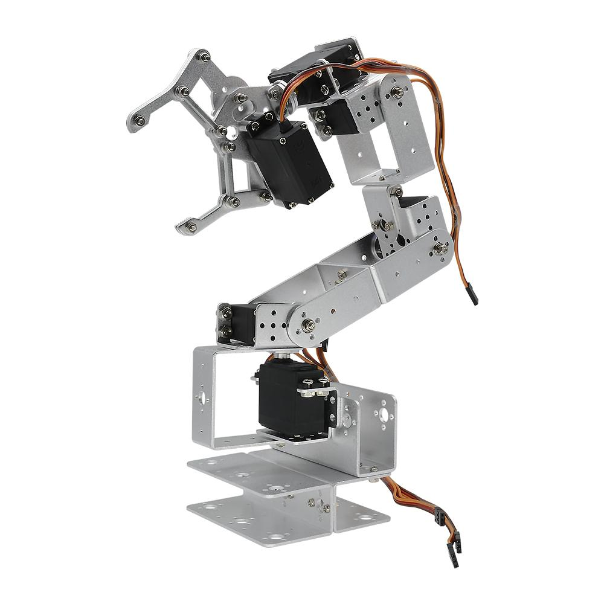
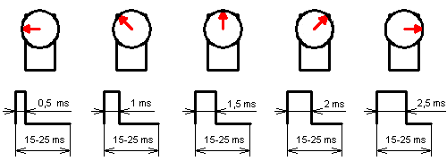
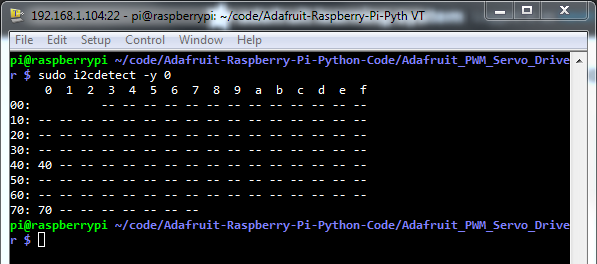

This is a small project aimed at building a 6 DOF robot arm using inexpensive components, and control it through a Raspberry Pi.

# Table of Contents
- [Table of Contents](#table-of-contents)
- [BOM](#bom)
- [Some Theory](#some-theory)
  - [Controlling Servo Motors](#controlling-servo-motors)
  - [Servo motor feedback](#servo-motor-feedback)
- [Raspberry Pi configuration](#raspberry-pi-configuration)
  - [Raspberry Pi set up](#raspberry-pi-set-up)
  - [Controlling servo motors with Raspberry Pi and the PWM Driver PCA9685](#controlling-servo-motors-with-raspberry-pi-and-the-pwm-driver-pca9685)
  - [Reading the feedback from servo motors with Raspberry Pi](#reading-the-feedback-from-servo-motors-with-raspberry-pi)

# BOM
List of components used:
* Raspberry Pi 2 Model B
* 32GB Micro SD card
* Robot Arm mechanical kit (Diymore ROT3U 6DOF Aluminium Robot Arm Mechanical Clamp Claw Kit, https://www.amazon.de/gp/product/B01LY4RHX2/)
* 6x Servo Motors (Lewan Soul LD-27MG, http://www.lewansoul.com/product/detail-19.html)
* 12V 30A Switching Power Supply (Xktts Ueercrr 12V 30A 360W, https://www.amazon.de/gp/product/B00P2CTT26)
* DC/DC 4.5-30V to 1-30V 12A Buck Converter (https://www.amazon.de/gp/product/B00HV4EPG8)
* Dual USB DC/DC Step Down Converter (https://www.amazon.de/gp/product/B0768D2NYH)
* Sunfounder PCA9685 16 Channel 12 Bit PMW Servo Driver (http://wiki.sunfounder.cc/index.php?title=PCA9685_16_Channel_12_Bit_PWM_Servo_Driver)
* 4x 45 cm Servo Extension Cable (https://www.amazon.de/gp/product/B01M7N77XC)
* 4x 20cm female-female Dupont jumper wire cable (https://www.amazon.de/gp/product/B00OL6JZ3C)
* 3-cores electric wire with plug
* 2-cores wire
* screws/nails
* USB-Micro USB cable

Tools:
* Multimeter
* Electric screwdriver
* Monitor/Keyboard/Mouse/Wi-Fi adapter/SD Adapter for Micro SD for the Raspberry Pi

Just to give a reference, I personally ordered almost everything on Amazon for the sake of simplicity (or laziness), and spent around 200€.

|**NOTE**|
|--------|
|The servo motors have to be physically modified in order to read the internal potentiometer.|

# Some Theory
Before moving on, it is necessary to understand how the various elements work, especially parts like servo motors, in order to avoid problems (i.e., avoid burning stuff like me due to too much excitement and not knowing how things work!).

## Controlling Servo Motors
A servo motor is usually controllable through PWM (Pulse Width Modulation). Specifically, its arm position depends on the width (or length) of the pulse applied to it.
A PWM signal encodes a ratio. The ratio of on to off is needed to get all the information; on alone is not enough. 
As a concrete example, PWM might be running at a frequency of 200Hz (or a period of 5ms). A 50% of maximum power signal (also known as Duty Cycle) would be on for 2.5ms, and off for 2.5ms. 
Change the frequency to 1000Hz, and hence the period becomes 1ms. The 50% duty cycle would now be 0.5ms on, and 0.5ms off. That PWM signal still encodes the same 50% power information.

Usually, servos can rotate between 0 and 180°. So we have to adjust the pulse length in between. A length of 1.5ms (7.5% duty cycle) thus gives an angle of 90°. And all at precisely 50 times per second (50Hz).
This diagram summarizes how a servo motor is controlled through PWM:

In my case I use the Lewan Soul LD-27MG, which has the following specs:
* working voltage: 6-7.4 V
* min working current: 1 A
* angle: between 0° and 270°
* Pulse Period: 20ms
  thus Frequency: 50Hz
* Pulse Width Range: between 0.5ms and 2.5ms
  thus Duty Cycle: between 2.5% and 12.5%

Conversion table:
Angle   | Pulse Width (ms) | Duty Cycle (%)
------- | ---------------- | --------------
0°      | 0.5              | 2.5
45°     | 0.8333           | 4.1666
90°     | 1.1666           | 5.8333
135°    | 1.5              | 7.5
180°    | 1.8333           | 9.1666
225°    | 2.1666           | 10.8333
270°    | 2.5              | 12.5

Links:
* https://www.teachmemicro.com/raspberry-pi-pwm-servo-tutorial/
* https://tutorials-raspberrypi.com/raspberry-pi-servo-motor-control/

## Servo motor feedback
Normal servo motors do not provide a feedback to the control board (in our case, the Raspberry Pi).
They simply take the PWM generated and do their best to fulfill the "request".

For our robot arm this is not ideal, because the arm could get stuck while doing a movement (for example, we try to push the arm against the table), and this leads to a stall of the servo motor.
Stalling a servo motor will damage it and the control board, as it will increase the current load (see https://electronics.stackexchange.com/questions/274721/how-does-blocking-a-servo-dc-motor-break-it).

Especially in my setup, once the PCA9685 control board sends the PWM signal to the servo motor, there is no way to stop the PWM signal or turn off the servo, and the board will burn out (it happened to me) if the servo stalls.

To understand if a servo motor is in stall (or, alternatively, is operating correctly), we need a feedback from it.
We can achieve this by tapping the potentiometer inside the servo motor, and read the measured voltage.

**[TO DO: How to modify the servo motors]**

Links:
* https://www.youtube.com/watch?v=w7qRs6tvxlM
* https://learn.adafruit.com/analog-feedback-servos/using-feedback
* https://electronics.stackexchange.com/questions/214761/how-to-measure-servo-potentiometer

# Raspberry Pi configuration

Here is the Raspberry Pi GPIO layout (http://pi4j.com/pins/model-2b-rev1.html) for reference:

## Raspberry Pi set up
To be able to control servo motor through the PCA9685 controller, we need to perform the following steps:
1. Activate the I2C interface in the Raspberry
    * run the command
    ``sudo raspi-config``
    * go to “Interfaces”, select “I2C”, select “Yes”
2. Configuring Raspberry Pi for I2C.
    * Install the following packages:
    ``sudo apt-get install python-smbus``
    ``sudo apt-get install i2c-tools``
    * Add the following lines to ``/etc/modules``:
    ``i2c-dev``
    ``i2c-bcm2708``
    * Reboot the Pi
3. Check that the PCA9685 controller is properly connected and it's set to its default address:
  ``sudo i2cdetect -y 1``
  It should show up at 0x40 (binary 1000000) as follows:
  
4. Connect the PCA9685 controller as in the diagram
5. Install the library https://github.com/adafruit/Adafruit_Python_PCA9685 by running the command:
  ``sudo pip install adafruit-pca9685``

Links:
* https://learn.adafruit.com/adafruit-16-channel-servo-driver-with-raspberry-pi/configuring-your-pi-for-i2c

## Controlling servo motors with Raspberry Pi and the PWM Driver PCA9685
**[TO DO]**

## Reading the feedback from servo motors with Raspberry Pi
**[TO DO]**
